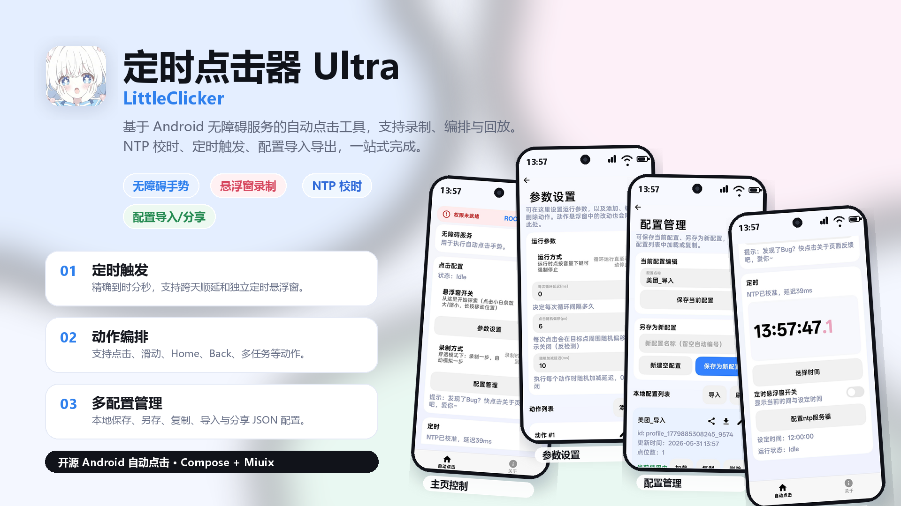
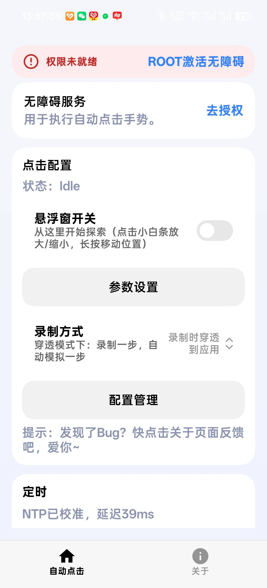
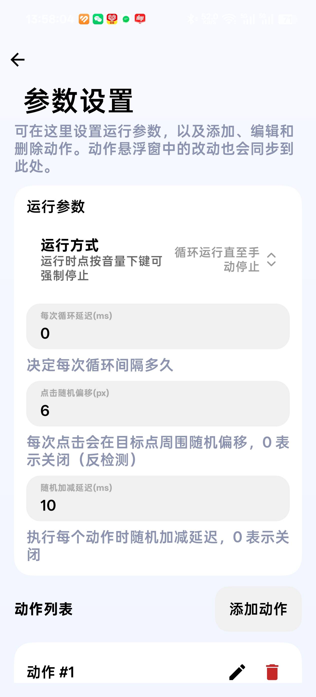
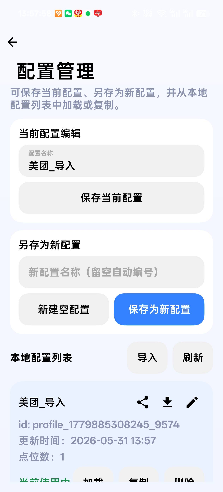
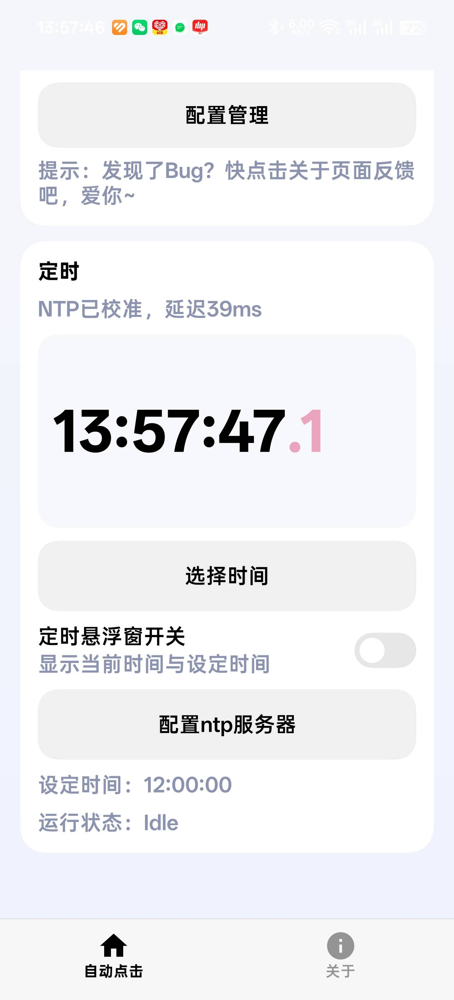

# 定时点击器Ultra

视频演示/Demo ：https://www.bilibili.com/video/BV1QBQ1ByE7U/

定时点击器 Ultra 是一个基于 Android 无障碍服务的自动点击工具，面向需要定时触发、重复执行、录制动作和管理多套点击配置的场景。项目使用 Kotlin、Jetpack Compose 与 Miuix 构建界面，支持悬浮窗录制、动作编排、NTP 校时和本地配置导入导出。

> 请在合法、合规、符合目标 App 使用规则的场景中使用本工具。

> 本软件使用100% AI Coding，如果有屎山，尽请谅解

## 核心功能

- 无障碍手势执行：通过 `dispatchGesture` 执行点击与滑动，并支持 Home、Back、多任务等系统动作。
- 悬浮窗录制：通过可拖拽悬浮面板录制动作、添加动作、编辑动作和运行脚本。
- 精准定时：支持 `HH:mm:ss` 定时触发、跨天顺延、NTP 校时和独立定时悬浮窗。
- 参数控制：支持循环模式、循环间隔、点击随机偏移、随机加减延迟、单动作延迟、触摸时长与重复次数。
- 配置管理：支持保存当前配置、另存为新配置、复制、加载、删除、导入和分享 JSON 配置。
- 运行保护：支持音量下键强制停止，录制与执行互斥，降低误触和重复录制风险。
- Miuix 风格界面：主要页面采用 Miuix 组件，并适配深浅色模式。

## 界面预览

| 首页控制 | 参数设置 | 配置管理 | NTP 定时 |
| --- | --- | --- | --- |
|  |  |  |  |

## 安装使用

打开[官网](https://littlecold.cn/)，下载并安装，给予权限即可。

## 权限说明

- 无障碍服务：用于执行自动点击、滑动和系统导航手势。
- 悬浮窗权限：用于显示动作悬浮窗、定时悬浮窗和运行提示层。
- 忽略电池优化：降低长时间等待定时触发时被系统清理的概率。
- 网络权限：用于 NTP 服务器校时和应用更新/公告检查。
- 存储相关权限：用于兼容不同 Android 版本下的配置导入、导出与分享。

## 构建

项目依赖 Android Gradle Plugin、Kotlin、Jetpack Compose、Material3、Navigation Compose、Gson 和 Miuix。

```powershell
.\gradlew.bat :app:assembleDebug
```

Release 构建需要本地提供 `keystore/release-signing.properties`，否则 Gradle 会主动中断，避免误产出未签名发布包。

## 项目结构

- `app/src/main/java/com/example/littleclicker/autoclick`：自动点击数据模型、仓库、协调器和 NTP 客户端。
- `app/src/main/java/com/example/littleclicker/service`：无障碍服务、动作悬浮窗服务、定时悬浮窗服务。
- `app/src/main/java/com/example/littleclicker/ui`：Compose/Miuix 页面与通用 UI 工具。
- `docs`：项目计划、模块说明、实现日志和 README 截图资源。
- `releases`：已导出的 APK/AAB 包。
